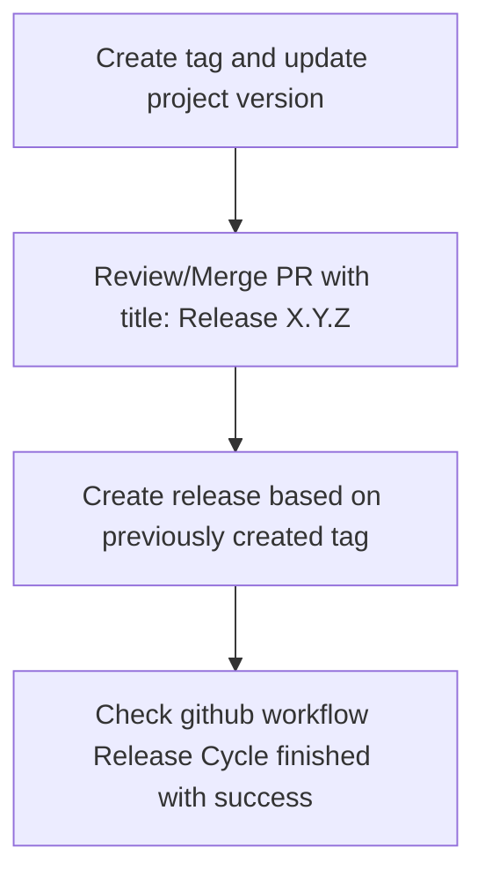

# Apache Ignite Migration Tool CI/CD

The project CI/CD relies on GitHub actions.

## Create release tag
In order to create release tag it is needed to start workflow called `Create tag and update project version`.
The Workflow creates release tag and makes a PR (pull request) which contains changes related to tag.
After the PR creation there will be started all tests.
The start of the tests is granted by repository secret `MAKE_PR`.
The secret `MAKE_PR` is simple PAT (personal access token) which should be generated for github user which started the workflow.
Here is [how to generate a PAT](https://docs.github.com/en/authentication/keeping-your-account-and-data-secure/creating-a-personal-access-token) instruction.
When configuring the PAT scopes you need only `workflow` scope.
After it's generation the PAT should be copied and set as value of `MAKE_PR` secret.

So before starting the workflow it is needed to ensure that `MAKE_PR` is set correctly, otherwise
you will get exceptions like this: 
```text
fatal: could not read Username for 'https://github.com': No such device or address
Error: The process '/usr/bin/git' failed with exit code 128
```

### Create release tag PR
The PR and tag are generated as a result of `Create tag and update project version` run. The PR should be reviewed and `merged` into
main branch of repository. The GitHub UI allows to choose the next options for merging: 
 - Merge pull request
 - Squash and merge
 - Rebase and merge
 
Note that the PR MUST be `merged`, in order to save git commit id, because the generated tag is based on it.
There is `check release correctness` step in `Release Cycle` which will check this, and if it will not find the
commit id on which tag is based inside main branch it will fail release.
So you have to choose the first option `Merge pull request`.

## Release Cycle
The Release Cycle was designed to provide reliable path to release project.
It guarantees all checks/tests have been passed successfully before any artifacts are published to GitHub Packages and Maven Central.

In order to release new project version it is needed to follow through GitHub actions steps.
There is GitHub workflow called `Create tag and update project version`.
This workflow should be started manually in order to update project version and create tag.

The tag for a version MUST be "X.Y.Z" e.g. "3.1.0".

After `Create tag and update project version` workflow succeeds then
automatically will be created a new PR with title `Release "X.Y.Z"`.
The automatically created PR should be reviewed and merged into main branch of repository.
After that release creation will become available.
Release in this project is handled by `Release Cycle` workflow.
The release cycle includes steps:
 1. Check main CI
 2. Check demo CI
 3. Check release correctness
 4. Release/Publish artifacts to GitHub Packages and Maven Central
 5. Update release body with results of `Release Cycle` run

These steps are automatically executed on event `release -> created` which is published after release creation.
The last step `Release/Publish artifacts ...` becomes available only if all previous steps finished with success.

### Release Cycle secrets
Release cycle requires the following secrets to be set in repository:
 - OSSRH_USERNAME - username of user which is allowed to publish to maven central 
 - OSSRH_TOKEN - password of user which is allowed to publish to maven central 
 - MAVEN_GPG_PASSPHRASE - passphrase of gpg key 
 - MAVEN_GPG_PRIVATE_KEY - gpg private key
For information about gpg key configuration please read [gpg readme](README_GPG.md).
Note: usually you do not need to set secrets.

## Overview
The following illustration will help in understanding all the above:



In case some steps are missed then the release cycle workflow will fail with error and no packages will be published
to GitHub Packages and Maven Central.
