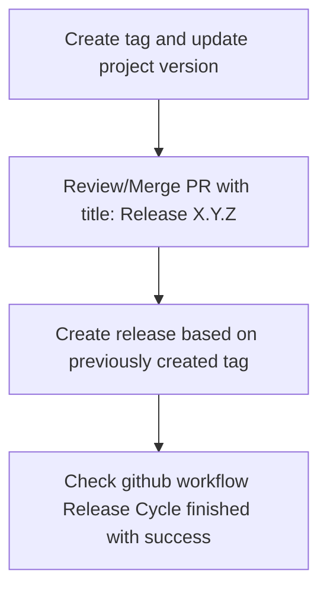

# Apache Ignite Migration Tool CI/CD

The project CI/CD relies on GitHub actions.

## Release Cycle
The Release Cycle was designed to provide reliable path to release project.
It guarantees all checks/tests have been passed successfully before any artifacts are published to GitHub Packages and Maven Central.

In order to release new project version it is needed to follow through GitHub actions steps.
There is GitHub workflow called `Create tag and update project version`.
This workflow should be started manually in order to update project version and create tag.

The tag for a version MUST be "X.Y.Z" e.g. "3.1.0".

After `Create tag and update project version` workflow succeeds then
automatically will be created a new PR with title `Release "X.Y.Z"`.
The automatically created PR should be reviewed and merged into main branch of repository.
After that release creation will become available.
Release in this project is handled by `Release Cycle` workflow.
The release cycle includes steps:
 1. Check main CI
 2. Check demo CI
 3. Check release correctness
 4. Release/Publish artifacts to GitHub Packages and Maven Central

These steps are automatically executed on event `release -> created` which is published after release creation.
The last step `Release/Publish artifacts ...` becomes available only if all previous steps finished with success.
The following illustration will help in understanding all the above:

In case some steps are missed then the release cycle workflow will fail with error and no packages will be published
to GitHub Packages and Maven Central.
